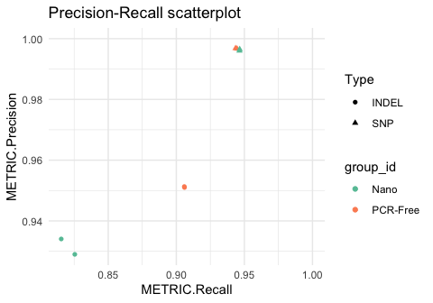

# happyR

[](https://travis-ci.org/Illumina/happyR)
[](https://codecov.io/gh/Illumina/happyR)

Load [hap.py](https://github.com/Illumina/hap.py) results into an R data
structure to enable simple plotting, comparisons and aggregation.

## Install

``` r
devtools::install_github("Illumina/happyR")
```

## Usage

``` r
# set up
library(happyR)
library(tidyverse, quietly = TRUE)
#> ── Attaching packages ─────────────────────────────────────────────────────────────────────── tidyverse 1.2.1.9000 ──
#> ✔ ggplot2 3.2.0.9000     ✔ purrr   0.3.2     
#> ✔ tibble  2.1.1          ✔ dplyr   0.8.1.9000
#> ✔ tidyr   0.8.3          ✔ stringr 1.4.0     
#> ✔ readr   1.3.1          ✔ forcats 0.4.0
#> Warning: package 'tibble' was built under R version 3.4.4
#> Warning: package 'tidyr' was built under R version 3.4.4
#> Warning: package 'readr' was built under R version 3.4.4
#> Warning: package 'purrr' was built under R version 3.4.4
#> Warning: package 'stringr' was built under R version 3.4.4
#> Warning: package 'forcats' was built under R version 3.4.4
#> ── Conflicts ─────────────────────────────────────────────────────────────────────────────── tidyverse_conflicts() ──
#> ✖ dplyr::filter() masks stats::filter()
#> ✖ dplyr::lag()    masks stats::lag()


# define happyr samplesheet
extdata_dir <- system.file("extdata", package = "happyR")
samplesheet <- readr::read_csv("group_id,replicate_id,happy_prefix
PCR-Free,NA12878-I30,NA12878-I30_S1
PCR-Free,NA12878-I33,NA12878-I33_S1
Nano,NA12878-R1,NA12878-R1_S1
Nano,NA12878-R2,NA12878-R2_S1
") %>% 
mutate(happy_prefix = sprintf("%s/%s", extdata_dir, happy_prefix))


# load hap.py results
hap_samplesheet <- read_samplesheet_(samplesheet)
#> Processing /Library/Frameworks/R.framework/Versions/3.4/Resources/library/happyR/extdata/NA12878-I30_S1
#> Reading summary table
#> Reading extended table
#> Reading precision-recall curve data
#> Missing file: /Library/Frameworks/R.framework/Versions/3.4/Resources/library/happyR/extdata/NA12878-I30_S1.roc.Locations.SNP.csv.gz
#> Missing file: /Library/Frameworks/R.framework/Versions/3.4/Resources/library/happyR/extdata/NA12878-I30_S1.roc.Locations.SNP.PASS.csv.gz
#> Missing file: /Library/Frameworks/R.framework/Versions/3.4/Resources/library/happyR/extdata/NA12878-I30_S1.roc.Locations.SNP.SEL.csv.gz
#> Processing /Library/Frameworks/R.framework/Versions/3.4/Resources/library/happyR/extdata/NA12878-I33_S1
#> Reading summary table
#> Reading extended table
#> Reading precision-recall curve data
#> Missing file: /Library/Frameworks/R.framework/Versions/3.4/Resources/library/happyR/extdata/NA12878-I33_S1.roc.Locations.SNP.csv.gz
#> Missing file: /Library/Frameworks/R.framework/Versions/3.4/Resources/library/happyR/extdata/NA12878-I33_S1.roc.Locations.SNP.PASS.csv.gz
#> Missing file: /Library/Frameworks/R.framework/Versions/3.4/Resources/library/happyR/extdata/NA12878-I33_S1.roc.Locations.SNP.SEL.csv.gz
#> Processing /Library/Frameworks/R.framework/Versions/3.4/Resources/library/happyR/extdata/NA12878-R1_S1
#> Reading summary table
#> Reading extended table
#> Reading precision-recall curve data
#> Missing file: /Library/Frameworks/R.framework/Versions/3.4/Resources/library/happyR/extdata/NA12878-R1_S1.roc.Locations.SNP.csv.gz
#> Missing file: /Library/Frameworks/R.framework/Versions/3.4/Resources/library/happyR/extdata/NA12878-R1_S1.roc.Locations.SNP.PASS.csv.gz
#> Missing file: /Library/Frameworks/R.framework/Versions/3.4/Resources/library/happyR/extdata/NA12878-R1_S1.roc.Locations.SNP.SEL.csv.gz
#> Processing /Library/Frameworks/R.framework/Versions/3.4/Resources/library/happyR/extdata/NA12878-R2_S1
#> Reading summary table
#> Reading extended table
#> Reading precision-recall curve data
#> Missing file: /Library/Frameworks/R.framework/Versions/3.4/Resources/library/happyR/extdata/NA12878-R2_S1.roc.Locations.SNP.csv.gz
#> Missing file: /Library/Frameworks/R.framework/Versions/3.4/Resources/library/happyR/extdata/NA12878-R2_S1.roc.Locations.SNP.PASS.csv.gz
#> Missing file: /Library/Frameworks/R.framework/Versions/3.4/Resources/library/happyR/extdata/NA12878-R2_S1.roc.Locations.SNP.SEL.csv.gz


# query and visualise performance metrics
summary <- extract_results(hap_samplesheet$results, table = "summary") %>% 
  inner_join(samplesheet, by = "happy_prefix")
summary %>% 
  filter(Filter == "PASS") %>% 
  ggplot(aes(x = METRIC.Recall, y = METRIC.Precision, color = group_id, shape = Type)) +
  geom_point() +
  xlim(NA, 1) +
  ylim(NA, 1) +
  theme_minimal() + 
  scale_color_brewer(palette = "Set2") +
  scale_size(guide = "none") +
  ggtitle("Precision-Recall scatterplot")  
```



## System requirements

Originally developed for R v3.4.0.
[Tests](https://travis-ci.org/Illumina/happyR) are run using the most
recent available R versions (incl. devel) on Ubuntu (Trusty) and OS X
(El Capitan) platforms. happyR has not been tested on Windows.
Dependencies are listed in [DESCRIPTION](DESCRIPTION).
