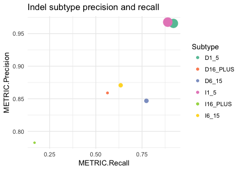
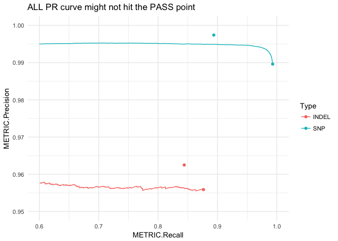
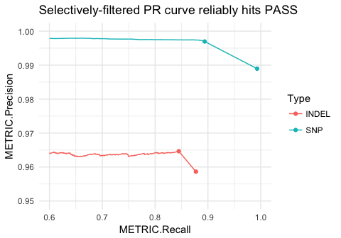

happyR
======

[](https://travis-ci.org/Illumina/happyR)

Load [hap.py](https://github.com/Illumina/hap.py) results into an R data structure to enable simple plotting, comparisons and aggregation. The related package [happyCompare](https://github.com/Illumina/happyCompare) builds on happyR with statistical analysis of groups and replicates, as well as providing some more sophisticated plotting and reporting functionality.

Install
-------

Use devtools:

``` r
devtools::install_github("Illumina/happyR")
```

Usage
-----

``` r
library(happyR)

# demo data that comes with the package
happy_input <- system.file("extdata", "happy_demo.summary.csv", package = "happyR")
happy_prefix <- sub(".summary.csv", "", happy_input)

# happy_prefix is the -o argument to hap.py, here: path/to/files/happy_demo
hapdata <- read_happy(happy_prefix)
#> Reading summary table
#> Reading extended table
#> Reading precision-recall curve data
hapdata
#>   Hap.py result containing:  summary, extended, pr_curve 
#>    Loaded from:  /Users/bmoore1/Rlibs/happyR/extdata/happy_demo  (hap.py version: v0.3.9)
#> 
#> # A tibble: 4 x 17
#>    Type Filter TRUTH.TOTAL TRUTH.TP TRUTH.FN QUERY.TOTAL QUERY.FP
#>   <chr>  <chr>       <int>    <int>    <int>       <int>    <int>
#> 1 INDEL    ALL        8937     7839     1098       11812      343
#> 2 INDEL   PASS        8937     7550     1387        9971      283
#> 3   SNP    ALL       52494    52125      369       90092      582
#> 4   SNP   PASS       52494    46920     5574       48078      143
#> # ... with 10 more variables: QUERY.UNK <int>, FP.gt <int>,
#> #   METRIC.Recall <dbl>, METRIC.Precision <dbl>, METRIC.Frac_NA <dbl>,
#> #   METRIC.F1_Score <dbl>, TRUTH.TOTAL.TiTv_ratio <dbl>,
#> #   QUERY.TOTAL.TiTv_ratio <dbl>, TRUTH.TOTAL.het_hom_ratio <dbl>,
#> #   QUERY.TOTAL.het_hom_ratio <dbl>
```

`hapdata` is now a single hap.py data object containing:

-   `summary` (from summary.csv) - high-level ALL / PASS numbers
-   `extended` (from extended.csv) - region / subtype stratified metrics
-   `pr_curve` (from roc.\*.csv.gz) - precision-recall over quality score

``` r
names(hapdata)
#> [1] "summary"  "extended" "pr_curve"

# e.g. here pr_curve$INDEL_PASS maps to happy_demo.roc.Locations.INDEL.PASS.csv.gz
names(hapdata$pr_curve)
#> [1] "INDEL_SEL"  "INDEL_PASS" "SNP"        "all"        "INDEL"     
#> [6] "SNP_PASS"   "SNP_SEL"
```

Example plots
-------------

### Indel subtypes

Here subtypes are categories based on the variant type and length (e.g. `I6_15` are insertions of length 6 bp up to 15 bp). Genomic subsets are `*` for all, `TS_contained` for truth variants fully-contained with confident regions and `TS_boundary` for truth variants near the edge of a confident region block. See [hap.py docs](https://github.com/Illumina/hap.py/blob/master/doc/happy.md) for more info.

``` r
library(ggplot2)

# get indel subtypes from 'extended', skipping complex alleles and combined
indel_extended <- subset(hapdata$extended, Type == "INDEL" & 
                         Filter == "ALL" & grepl("^[DI]", Subtype))

# Precision-recall by subtype, scaled by number in truthset
ggplot(indel_extended, aes(x = METRIC.Recall, y = METRIC.Precision, 
                           col = Subtype, size = TRUTH.TOTAL, shape=Subset)) +
  geom_point() + theme_minimal() + 
  scale_color_brewer(palette = "Set2") +
  scale_size(guide = "none") +
  ggtitle("Indel subtype precision and recall")
```



### Precision-recall curves

PR curves show how precision and recall vary with a changing threshold, in this example it's over a range of quality score thresholds applied to a set of variants: as the threshold increases, the remaining variant set is less comprehensive (lower recall) but typically contains fewer false positives (higher precision).

This gets more complicated when `PASS` records aren't set solely by a single quality score threshold, but by multiple independent filters (e.g. high-depth, genomic context, etc.). These interactions can't be fully captured by drawing a PR curve only on a quality threshold:

``` r
# using happyR::pr_data to simplify subsetting:
all_pr <- pr_data(hapdata)

# this gets PR curve starting at ALL point, equivalent to base:
# all_pr <- subset(hapdata$pr_curve$all, Filter == "ALL" & Subtype == "*" & Subset == "*")

ggplot(all_pr, aes(x = METRIC.Recall, y = METRIC.Precision, col = Type)) +
  geom_line() + theme_minimal() +
  geom_point(data = hapdata$summary) +
  scale_x_continuous(limits = c(.6, 1)) +
  scale_y_continuous(limits = c(.95, 1)) +
  ggtitle("ALL PR curve might not hit the PASS point")
```



Hap.py accounts for this by generating a selectively-filtered PR curve (`SEL`). First these independent filters are applied to the variant set, then we can draw the remaining PR curve using the quality score threshold. This gives a more accurate view of how changing the quality score threshold can impact precision and recall.

``` r
# selectively filtered PR curve
pr <- pr_data(hapdata, filter = "SEL")

# link this to the ALL point
pr <- dplyr::bind_rows(pr, subset(hapdata$summary, Filter == "ALL"))

ggplot(pr, aes(x = METRIC.Recall, y = METRIC.Precision, col = Type)) +
  geom_line() + theme_minimal() +
  geom_point(data = hapdata$summary) +
  scale_x_continuous(limits = c(.6, 1)) +
  scale_y_continuous(limits = c(.95, 1)) +
  ggtitle("Selectively-filtered PR curve reliably hits PASS")
```


